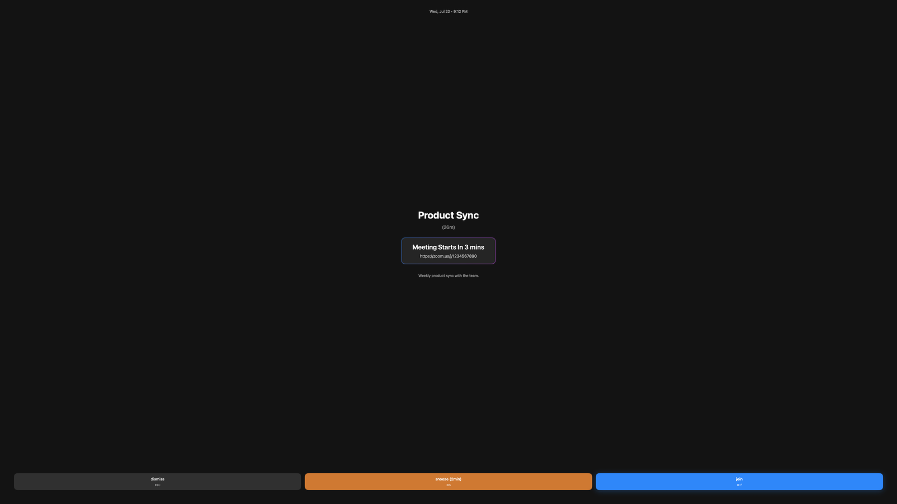
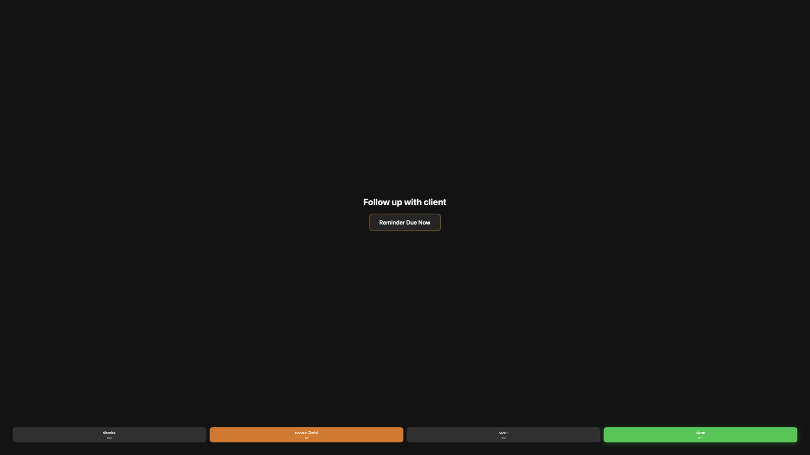
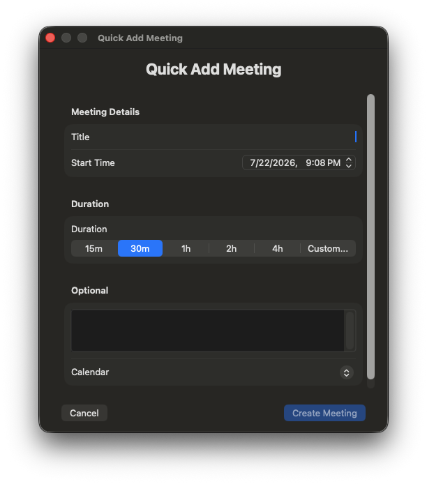
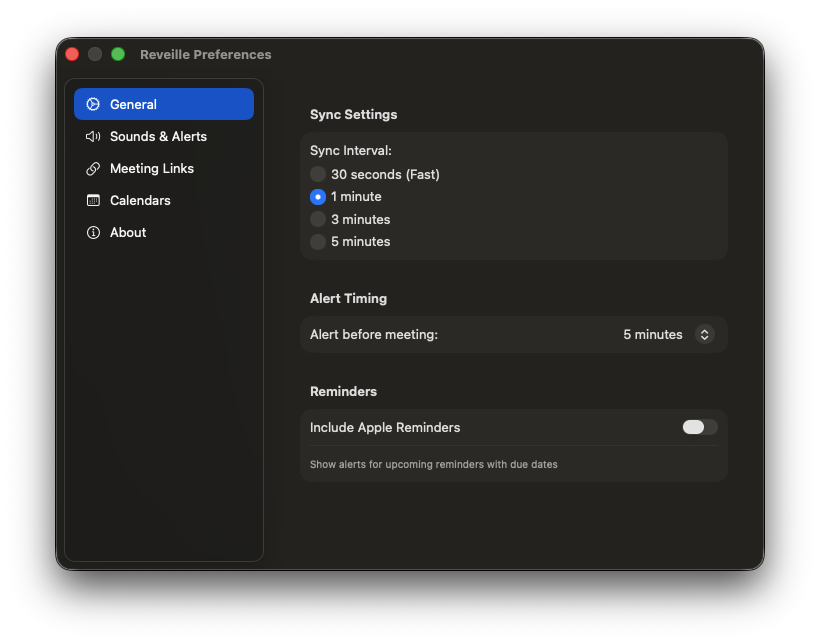
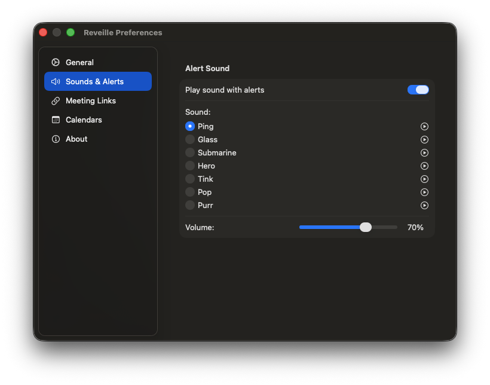
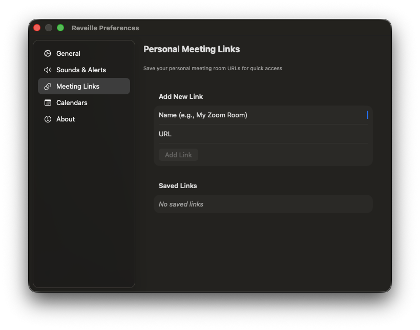
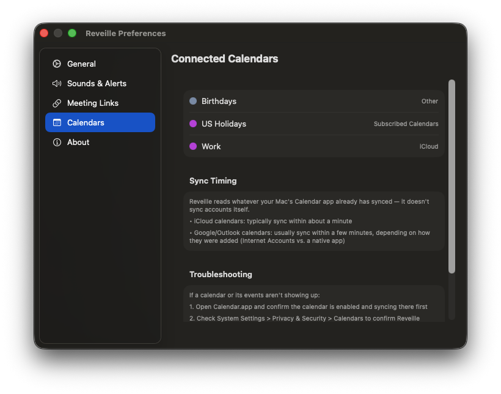

# Reveille

[](https://github.com/greenjacketcoder/reveille/actions/workflows/swift.yml)
[](https://github.com/greenjacketcoder/reveille)
[](#requirements)
[](https://github.com/greenjacketcoder/reveille)
[](LICENSE)

A free, open-source macOS meeting reminder app — similar to Chime, but completely free.

Reveille lives in your menu bar, watches your calendars, and puts a full-screen, impossible-to-ignore alert in front of you before each meeting.

<p align="center">
  
</p>

## Screenshots

<table>
<tr>
<td width="50%"><br><sub>Reminder alert — complete, snooze, or open in Reminders.app</sub></td>
<td width="50%"><br><sub>Quick Add Meeting, with duration presets and link auto-fill</sub></td>
</tr>
<tr>
<td width="50%"><br><sub>General — sync interval, alert timing</sub></td>
<td width="50%"><br><sub>Sounds & Alerts — preview and volume</sub></td>
</tr>
<tr>
<td width="50%"><br><sub>Meeting Links — save recurring rooms</sub></td>
<td width="50%"><br><sub>Calendars — connections and sync notes</sub></td>
</tr>
</table>

## Features

**Alerts**
- Full-screen, FaceTime-style alerts, timed 1–15 minutes before a meeting
- Works with any calendar synced to macOS (iCloud, Google, Outlook, etc.)
- Automatic meeting link detection — Zoom, Google Meet, Microsoft Teams, Discord, Slack, FaceTime
- One-click join, snooze (2 min), or dismiss
- Keyboard shortcuts: Enter to join, Esc to dismiss
- Apple Reminders support — get the same full-screen treatment for reminders with due dates, and mark them complete or open them in Reminders.app directly from the alert

**Creating meetings**
- Quick Add Meeting from the menu bar, with duration presets (15m/30m/1h/2h/4h or custom)
- Pick which calendar a new meeting goes to
- Auto-fill the meeting link from a saved Personal Meeting Link

**Customization**
- Sync interval: 30 seconds, 1, 3, or 5 minutes
- 7 built-in alert sounds with previews and volume control
- Personal Meeting Links — save your recurring Zoom/Meet rooms for one-click access from the menu bar or Quick Add

**Updates**
- Automatic update checks via [Sparkle](https://sparkle-project.org/), the standard macOS updater framework
- Every release is cryptographically signed (EdDSA); Reveille verifies that signature before installing anything, independent of Gatekeeper
- "Check for Updates..." available anytime from the menu bar

## Requirements

- macOS 13.0 (Ventura) or later
- Xcode 14.0 or later (for building — see below)

## Installation

Grab the latest `.dmg` from [Releases](https://github.com/greenjacketcoder/reveille/releases/latest), open it, and drag Reveille into Applications.

**Important — Reveille isn't notarized yet** (pending Apple Developer Program enrollment), so macOS Gatekeeper will block the first launch. Downloaded/installed copies get a quarantine flag that a plain double-click won't get past. Fix it once with either of these:

- **Right-click (Control-click) Reveille.app → Open**, then click **Open** in the dialog that appears. On some macOS versions this shows an unhelpful "is damaged and can't be opened" message with no Open option — if you hit that, use the Terminal command below instead.
- **Terminal (most reliable):**
  ```bash
  xattr -cr /Applications/Reveille.app
  ```
  This clears the quarantine flag from the app you just installed. After that, it opens normally — no need to repeat this on future launches or updates.

Once notarization is set up, this step goes away entirely.

**Building from source instead:**

```bash
git clone https://github.com/greenjacketcoder/reveille.git
cd reveille
open MacAlert.xcodeproj
```

Then in Xcode: select your development team in the project settings, and build & run (⌘R). Grant calendar access when prompted. Apps run directly from Xcode aren't quarantined, so the Gatekeeper step above doesn't apply here.

## Settings

Preferences (⌘,) has five tabs:

| Tab | What's there |
|---|---|
| **General** | Sync interval, alert timing, Apple Reminders toggle |
| **Sounds & Alerts** | Sound picker with previews, volume |
| **Meeting Links** | Add/remove your personal meeting room URLs |
| **Calendars** | Which calendars are connected, plus sync-timing notes and troubleshooting steps |
| **About** | Version info, links to this repo, issues, and the license |

## How It Works

Reveille checks your calendars at your configured interval (default: 1 minute). If calendar access hasn't been granted yet, it retries automatically (5s → 15s → 45s) and shows retry progress in the menu bar rather than failing silently. When a meeting is within your alert window (default: 5 minutes), it shows a full-screen alert with the title, location, a live countdown, and notes, plus Join / Snooze / Dismiss.

## Privacy

Reveille is designed to be as private as a menu bar app can be:

- **No accounts, no sign-in** — there's no login screen, no third-party auth, and nothing to create or remember.
- **Minimal network calls** — only two things touch the network: (1) *you* clicking "Join," which opens the meeting link in your browser, and (2) an automatic daily check against a static `appcast.xml` file to see if a new version is out. That check is a plain file fetch — it doesn't send anything about you, your calendar, or your usage. Checking calendars, reminders, and settings themselves never leave your Mac.
- **No analytics or telemetry** — nothing is tracked, logged remotely, or sent anywhere. Sparkle's optional anonymous system-profile submission is explicitly disabled (`SUEnableSystemProfiling` = false in `Info.plist`).
- **Local-only data** — calendar and reminder data is read through Apple's EventKit framework and never cached or written elsewhere; settings are stored locally via `UserDefaults`.
- **Sandboxed permissions** — the app only requests what it needs: Calendars, and Reminders (only if you enable Apple Reminders support in Settings).

It's open source, so you don't have to take this on faith — `CalendarManager.swift` and `AppDelegate` show exactly what's read and what happens with it.

## Changelog

See [CHANGELOG.md](CHANGELOG.md) for release history.

## Contributing

Issues and PRs are welcome — see the About tab in-app for quick links, or go straight to [Issues](https://github.com/greenjacketcoder/reveille/issues).

## License

MIT License — free to use, modify, and distribute. See [LICENSE](LICENSE).
